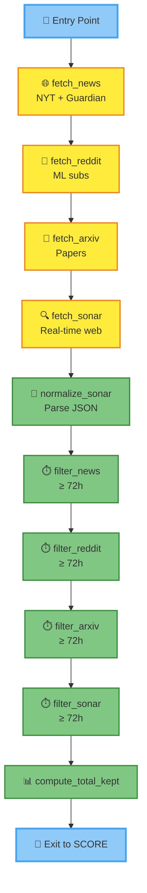

# 🤖 AI/LLM Curation Worker v6.3

Architecture hiérarchique SSOT pour curation automatisée IA/LLM (≤72h, 4 sources, validation qualité Sonar, rapports FR).

---

## 🎯 Objectif

Produire quotidiennement un **Top 10 IA/LLM** de haute qualité :
- **4 sources** : News (NYT/Guardian), Reddit, arXiv, Sonar
- **Fraîcheur stricte** : ≤ 72 heures
- **Validation qualité** : score Sonar ≥ 7/10 (max 3 tentatives)
- **Rapport FR** : markdown lisible, professionnel, accessible

---

## 📁 Architecture hiérarchique (SSOT)

### Principe : Single Source of Truth
- **Chaque node défini UNE SEULE FOIS** dans son subgraph
- **Pas de duplication** : edges intra-SG dans subgraph, inter-SG dans main
- **Navigation récursive** : vue macro → clic boîte → vue détail → drill-down infini

```
workers/ai_curation/
├── main.process.json                 (1.8KB)  # Orchestration 5 subgraphs
│
├── config/                           # Configurations
│   ├── worker_ctx.json               (248B)   # Modèles, seuils, DB
│   └── scopes.json                   (589B)   # Namespaces cycle
│
├── prompts/                          # Data lourdes (LLM prompts)
│   ├── gpt_scoring.json              (2.0KB)  # Scoring multi-sources
│   ├── sonar_fetch.json              (0.9KB)  # Fetch real-time Sonar
│   ├── sonar_validation.json         (1.9KB)  # Validation qualité
│   ├── gpt_format_fr.json            (2.0KB)  # Format rapport FR
│   └── gpt_merge_report_fr.json      (1.7KB)  # Fusion/dédoublonnage
│
├── subgraphs/                        # Phases autonomes (SSOT)
│   ├── 01_init.subgraph.json         (2.1KB)  # Dates + DB setup
│   ├── 02_collect.subgraph.json      (4.8KB)  # Fetch 4 sources + filter
│   ├── 03_score.subgraph.json        (1.2KB)  # GPT scoring top 10
│   ├── 04_validate.subgraph.json     (4.9KB)  # Validation loop Sonar
│   └── 05_output.subgraph.json       (1.8KB)  # Format FR + save DB
│   └── 06_enrich.subgraph.json       (5.2KB)  # Enrich primary sources
│
└── visualization/                    # Mermaid avec emojis
    ├── main_global.mmd               (830B)   # Vue macro (5 boîtes)
    ├── subgraph_COLLECT.mmd          (1.4KB)  # Détail COLLECT (4 sources)
    └── subgraph_VALIDATE.mmd         (1.9KB)  # Détail VALIDATE
```

**Taille totale** : ~30KB (vs 23KB ancien monolithe)  
**Plus gros fichier** : 4.8KB (02_collect.subgraph.json)

---

## 🎨 Vue globale (5 subgraphs)

```mermaid
graph LR
  START([🚀 START])
  INIT[🔧 INIT<br>dates + DB setup]
  COLLECT[📦 COLLECT<br>4 sources + filter]
  SCORE[🎯 SCORE<br>GPT top 10]
  VALIDATE[✅ VALIDATE<br>Sonar quality check]
  OUTPUT[💾 OUTPUT<br>Format FR + save]
  EXIT([🏁 EXIT])
  
  START-->INIT
  INIT-->COLLECT
  COLLECT-->SCORE
  SCORE-->VALIDATE
  VALIDATE-->|🔄 retry|SCORE
  VALIDATE-->|✓ success|ENRICH
  VALIDATE-->|🛑 retry_exhausted|ENRICH
  ENRICH-->OUTPUT
  OUTPUT-->EXIT
  
  class INIT init
  class COLLECT collect
  class SCORE score
  class VALIDATE validate
  class OUTPUT output
  
  classDef init fill:#2196F3,stroke:#1976D2,stroke-width:2px,color:#fff
  classDef collect fill:#4CAF50,stroke:#388E3C,stroke-width:2px,color:#fff
  classDef score fill:#FF9800,stroke:#F57C00,stroke-width:2px,color:#fff
  classDef validate fill:#9C27B0,stroke:#7B1FA2,stroke-width:2px,color:#fff
  classDef output fill:#607D8B,stroke:#455A64,stroke-width:2px,color:#fff
```



👆 Clic sur une boîte → affiche le détail du subgraph

---

## 🔎 Vue détail : COLLECT (exemple)



[◀ Retour vue globale]

---

## 🚀 Démarrage rapide

```python
from src.tools.orchestrator import run

# Start worker
run(
    operation="start",
    worker_name="ai_curation",
    worker_file="workers/ai_curation/main.process.json",
    hot_reload=True
)

# Status (avec position actuelle)
status = run(operation="status", worker_name="ai_curation")
print(status)
# → {"status": "running", "current_node": "filter_arxiv", "subgraph": "COLLECT", ...}

# Stop
run(operation="stop", worker_name="ai_curation", stop={"mode": "soft"})
```

---

## 🔄 Workflow détaillé

### 🔧 1. INIT (Initialization)
- UTC now → now - 3 jours
- CREATE TABLE IF NOT EXISTS (validation_logs, reports)

### 📦 2. COLLECT (Multi-Source Collection)
- Fetch (4 sources): News, Reddit, arXiv, Sonar
- Normalisation & filtres (≥ ${cycle.dates.from})
- compute_total_kept via tool math

### 🎯 3. SCORE (GPT Scoring)
- GPT-4o-mini analyse tout → top 10 JSON
- Normalisation → JSON strict
- Stringify top10 pour DB INSERT

### ✅ 4. VALIDATE (Quality Validation Loop)
- Sonar quality → score + feedback
- Log en DB (validation_logs)
- Seuil ≥ ${worker.quality_threshold} ?
  - Oui → success
  - Non → increment_retry → retry_count < ${worker.max_retries} ?
    - Oui → exit retry → boucle vers SCORE
    - Non → retry_exhausted → ENRICH

### 💾 5. OUTPUT (Format & Save)
- GPT format FR (markdown) + timestamp
- DB INSERT (reports)

---

## 🗄️ Base de données

SQLite (fichier injecté par runner: ${worker.db_file})

Tables principales:
- validation_logs(id, timestamp, attempt, score, feedback, top10_json)
- reports(id, date_from, date_to, report_markdown, avg_score, retry_count, top10_json, completed_at)

---

## ⚙️ Configuration

worker_ctx.json (extrait):
```json
{
  "llm_model": "gpt-4o-mini",
  "sonar_model": "sonar",
  "llm_temperature": 0.3,
  "quality_threshold": 7,
  "max_retries": 3
}
```

---

## 🧭 Visualisation interactive (viewer)

- main_global.mmd → vue macro
- subgraph_COLLECT.mmd → détail COLLECT (4 sources)
- subgraph_VALIDATE.mmd → détail VALIDATE

CSS d’animation (exemple):
```css
/* Node actuel */
.node.running {
  fill: #FFC107 !important;
  stroke: #FF6F00;
  stroke-width: 3px;
  filter: drop-shadow(0 0 8px #FFC107);
  animation: pulse 1s infinite;
}
```

---

## ✅ Checklist production
- [x] Edges cohérents (retry, retry_exhausted, success)
- [x] Exits déclarés côté subgraph VALIDATE
- [x] 4 sources uniquement (docs + prompts + viz)
- [x] JSON stringify avant INSERT DB
- [x] Seuils et retries paramétrés via worker_ctx

---

## 🗺️ Roadmap

### v6.3 (actuel)
- ✅ Boucle retry robuste + cohérence 4 sources
- ✅ Prompts harmonisés
- ✅ Visualisation COLLECT mise à jour

### v7.0 (future)
- [ ] Subgraphs imbriqués (récursion infinie)
- [ ] Conditional subgraphs (switch entre variantes)
- [ ] Parallel subgraphs (exécution concurrente)

---

**Version**: 6.3.0-ssot  
**Dernière mise à jour**: 2025-10-22  
**Auteur**: orchestrator-team
