# 🤖 AI/LLM Curation Worker v6.2

**Architecture hiérarchique SSOT pour curation automatisée IA/LLM (≤72h, 5 sources, validation qualité Sonar, rapports FR).**

---

## 🎯 Objectif

Produire quotidiennement un **Top 10 IA/LLM** de haute qualité :
- **5 sources** : News (NYT/Guardian), Reddit, arXiv, Papers With Code, Sonar
- **Fraîcheur stricte** : ≤ 72 heures
- **Validation qualité** : score Sonar ≥ 7/10 (max 3 tentatives)
- **Rapport FR** : markdown lisible, professionnel, accessible

---

## 📁 Architecture hiérarchique (SSOT)

### Principe : Single Source of Truth
- **Chaque node défini UNE SEULE FOIS** dans son subgraph
- **Pas de duplication** : edges intra-SG dans subgraph, inter-SG dans main
- **Navigation récursive** : vue macro → clic boîte → vue détail → drill-down infini

```
workers/ai_curation/
├── main.process.json                 (1.8KB)  # Orchestration 5 subgraphs
│
├── config/                           # Configurations
│   ├── worker_ctx.json               (248B)   # Modèles, seuils, DB
│   └── scopes.json                   (589B)   # Namespaces cycle
│
├── prompts/                          # Data lourdes (LLM prompts)
│   ├── gpt_scoring.json              (2.1KB)  # Scoring multi-sources
│   ├── sonar_fetch.json              (1.3KB)  # Fetch real-time Sonar
│   ├── sonar_validation.json         (1.9KB)  # Validation qualité
│   ├── gpt_format_fr.json            (2.0KB)  # Format rapport FR
│   └── gpt_merge_report_fr.json      (1.7KB)  # Fusion/dédouplonnage
│
├── subgraphs/                        # Phases autonomes (SSOT)
│   ├── 01_init.subgraph.json         (2.1KB)  # Dates + DB setup
│   ├── 02_collect.subgraph.json      (4.8KB)  # Fetch 5 sources + filter
│   ├── 03_score.subgraph.json        (1.2KB)  # GPT scoring top 10
│   ├── 04_validate.subgraph.json     (4.4KB)  # Validation loop Sonar
│   └── 05_output.subgraph.json       (1.8KB)  # Format FR + save DB
│
├── visualization/                    # Mermaid avec emojis
│   ├── main_global.mmd               (830B)   # Vue macro (5 boîtes)
│   ├── subgraph_COLLECT.mmd          (1.4KB)  # Détail COLLECT
│   └── subgraph_VALIDATE.mmd         (1.9KB)  # Détail VALIDATE
│
└── README.md                         (ce fichier)
```

**Taille totale** : ~30KB (vs 23KB ancien monolithe)  
**Plus gros fichier** : 4.8KB (02_collect.subgraph.json)

---

## 🎨 Vue globale (5 subgraphs)

```mermaid
graph LR
  START([🚀 START])
  INIT[🔧 INIT<br>dates + DB setup]
  COLLECT[📦 COLLECT<br>5 sources + filter]
  SCORE[🎯 SCORE<br>GPT top 10]
  VALIDATE[✅ VALIDATE<br>Sonar quality check]
  OUTPUT[💾 OUTPUT<br>Format FR + save]
  EXIT([🏁 EXIT])
  
  START-->INIT
  INIT-->COLLECT
  COLLECT-->SCORE
  SCORE-->VALIDATE
  VALIDATE-->|🔄 retry|SCORE
  VALIDATE-->|✓ success|OUTPUT
  OUTPUT-->EXIT
  
  class INIT init
  class COLLECT collect
  class SCORE score
  class VALIDATE validate
  class OUTPUT output
  
  classDef init fill:#2196F3,stroke:#1976D2,stroke-width:2px,color:#fff
  classDef collect fill:#4CAF50,stroke:#388E3C,stroke-width:2px,color:#fff
  classDef score fill:#FF9800,stroke:#F57C00,stroke-width:2px,color:#fff
  classDef validate fill:#9C27B0,stroke:#7B1FA2,stroke-width:2px,color:#fff
  classDef output fill:#607D8B,stroke:#455A64,stroke-width:2px,color:#fff
```



👆 **Clic sur une boîte** → affiche le détail du subgraph

---

## 🔍 Vue détail : COLLECT (exemple)

```mermaid
graph TB
  entry[🚪 Entry Point]
  
  fetch_news[🌐 fetch_news<br>NYT + Guardian]
  fetch_reddit[💬 fetch_reddit<br>ML subs]
  fetch_arxiv[📄 fetch_arxiv<br>Papers]
  fetch_pwc[🏆 fetch_pwc<br>Trending]
  fetch_sonar[🔍 fetch_sonar<br>Real-time web]
  
  normalize_sonar[🔄 normalize_sonar<br>Parse JSON]
  
  filter_news[⏱️ filter_news<br>geq 72h]
  filter_reddit[⏱️ filter_reddit<br>geq 72h]
  filter_arxiv[⏱️ filter_arxiv<br>geq 72h]
  filter_sonar[⏱️ filter_sonar<br>geq 72h]
  
  count_pwc[📊 count_pwc<br>Pass-through]
  exit[🚪 Exit to SCORE]
  
  entry-->fetch_news
  fetch_news-->fetch_reddit
  fetch_reddit-->fetch_arxiv
  fetch_arxiv-->fetch_pwc
  fetch_pwc-->fetch_sonar
  fetch_sonar-->normalize_sonar
  normalize_sonar-->filter_news
  filter_news-->filter_reddit
  filter_reddit-->filter_arxiv
  filter_arxiv-->filter_sonar
  filter_sonar-->count_pwc
  count_pwc-->exit
  
  class entry entryNode
  class exit exitNode
  class fetch_news,fetch_reddit,fetch_arxiv,fetch_pwc,fetch_sonar ioNode
  class normalize_sonar,filter_news,filter_reddit,filter_arxiv,filter_sonar,count_pwc transformNode
  
  classDef entryNode fill:#90CAF9,stroke:#42A5F5,stroke-width:3px
  classDef exitNode fill:#90CAF9,stroke:#42A5F5,stroke-width:3px
  classDef ioNode fill:#FFEB3B,stroke:#F57F17,stroke-width:2px
  classDef transformNode fill:#81C784,stroke:#388E3C,stroke-width:2px
```



[◀ Retour vue globale]

---

## 🚀 Démarrage rapide

```python
from src.tools.orchestrator import run

# Start worker
run(
    operation="start",
    worker_name="ai_curation",
    worker_file="workers/ai_curation/main.process.json",
    hot_reload=True
)

# Status (avec position actuelle)
status = run(operation="status", worker_name="ai_curation")
print(status)
# → {"status": "running", "current_node": "filter_arxiv", "subgraph": "COLLECT", ...}

# Stop
run(operation="stop", worker_name="ai_curation", stop={"mode": "soft"})
```

---

## 🔄 Workflow détaillé

### 🔧 **1. INIT** (Initialization)
**Nodes** : 4  
**Entry** : `get_date_now`  
**Exit** : `ensure_reports_table`

1. `get_date_now` → UTC ISO now
2. `compute_from_date` → now - 3 jours
3. `ensure_validation_logs_table` → CREATE TABLE IF NOT EXISTS
4. `ensure_reports_table` → CREATE TABLE IF NOT EXISTS

---

### 📦 **2. COLLECT** (Multi-Source Collection)
**Nodes** : 11  
**Entry** : `fetch_news`  
**Exit** : `count_pwc`

**Fetch (5 sources)** :
- `fetch_news` → NYT/Guardian (from/to dates)
- `fetch_reddit` → MachineLearning/LocalLLaMA/OpenAI (time_filter=week)
- `fetch_arxiv` → LLM papers (max 30)
- `fetch_pwc` → Trending NLP papers (max 15)
- `fetch_sonar` → Real-time web search (user-only prompt)

**Normalize + Filter (≤72h)** :
- `normalize_sonar` → Parse JSON
- `filter_news/reddit/arxiv/sonar` → Filter by date (≥ ${from})
- `count_pwc` → Pass-through (already trending)

---

### 🎯 **3. SCORE** (GPT Scoring)
**Nodes** : 3  
**Entry** : `llm_gpt_score`  
**Exit** : `json_stringify_top10`

1. `llm_gpt_score` → GPT-4o-mini analyze all sources → top 10
2. `normalize_gpt_score` → Parse JSON response
3. `json_stringify_top10` → Stringify for DB insert (fix v5.5.2)

---

### ✅ **4. VALIDATE** (Quality Validation Loop)
**Nodes** : 10  
**Entry** : `get_validation_timestamp`  
**Exit** : `format_validation_log_message` (success) | `increment_retry` (retry)

**Loop logic** :
```
1. get_validation_timestamp
2. llm_sonar_validate → Sonar quality check
3. normalize_sonar_validation
4. extract_score + extract_feedback
5. insert_validation_log → DB log
6. check_score_threshold → ≥ 7 ?
   → TRUE : goto format_validation_log_message (exit success)
   → FALSE : goto increment_retry
7. increment_retry → retry_count++
8. check_retry_limit → < 3 ?
   → TRUE : jump back to SCORE (retry)
   → FALSE : goto format_validation_log_message (accept score)
```

---

### 💾 **5. OUTPUT** (Format & Save)
**Nodes** : 3  
**Entry** : `llm_format_fr`  
**Exit** : `save_report`

1. `llm_format_fr` → GPT format rapport FR (markdown)
2. `get_completion_timestamp`
3. `save_report` → DB INSERT (reports table)

---

## 🗄️ Base de données

**DB unique** : `ai_curation_reports.db` (défini dans worker_ctx.json)

### Table: validation_logs
```sql
CREATE TABLE validation_logs (
  id INTEGER PRIMARY KEY AUTOINCREMENT,
  timestamp TEXT NOT NULL,
  attempt INTEGER,
  score REAL,
  feedback TEXT,
  top10_json TEXT
);
```

### Table: reports
```sql
CREATE TABLE reports (
  id INTEGER PRIMARY KEY AUTOINCREMENT,
  date_from TEXT,
  date_to TEXT,
  report_markdown TEXT,
  avg_score REAL,
  retry_count INTEGER,
  top10_json TEXT,
  completed_at TEXT
);
```

---

## 🎯 Configuration

### worker_ctx.json
```json
{
  "llm_model": "gpt-4o-mini",
  "sonar_model": "sonar",
  "llm_temperature": 0.3,
  "quality_threshold": 7,
  "max_retries": 3,
  "db_name": "ai_curation_reports"
}
```

### Modifier seuils
- **quality_threshold** : score minimum (défaut: 7)
- **max_retries** : tentatives max scoring (défaut: 3)
- **llm_model** : modèle GPT (gpt-4o-mini, gpt-4, etc.)

---

## 🎨 Visualisation interactive (viewer)

### Principe : Navigation hiérarchique

```
┌─────────────────────────────────────┐
│ Vue MACRO (main.process.json)      │
│                                     │
│  🚀 → 🔧 → 📦 → 🎯 → ✅ → 💾 → 🏁 │
│             ↑ (vous êtes ici)      │
└─────────────────────────────────────┘
        👆 CLIC sur 📦 COLLECT
           ↓
┌─────────────────────────────────────┐
│ Vue DÉTAIL (02_collect.subgraph)   │
│                                     │
│  🌐 → 💬 → 📄 → 🏆 → 🔍           │
│                       ↓             │
│         ⏱️ → ⏱️ → ⏱️ → ⏱️ → 📊     │
│                  ↑ (node actuel)    │
│                                     │
│  [◀ Retour vue globale]            │
└─────────────────────────────────────┘
```

### API pour viewer

```python
# 1. Charger le process complet
process = load_process_with_imports("workers/ai_curation/main.process.json")

# 2. Status temps réel
status = run(operation="status", worker_name="ai_curation")
# → {"current_node": "filter_arxiv", "cycle_id": "cycle_001", ...}

# 3. Identifier le subgraph du node actuel
current_sg = find_subgraph_for_node(process, status["current_node"])
# → "COLLECT"

# 4. Charger le détail du subgraph
sg_detail = load_subgraph(process, "COLLECT")
# → {nodes: [...], edges: [...], interface: {...}}

# 5. Highlight dans SVG
highlight_node_in_svg("main_global.svg", "COLLECT", status="running")
highlight_node_in_svg("subgraph_COLLECT.svg", "filter_arxiv", status="running")
```

### Animation trail (CSS dynamique)

```css
/* Node actuel */
.node.running {
  fill: #FFC107 !important;
  stroke: #FF6F00;
  stroke-width: 3px;
  filter: drop-shadow(0 0 8px #FFC107);
  animation: pulse 1s infinite;
}

/* Nodes traversés */
.node.visited {
  opacity: 0.7;
  fill: #4CAF50;
}

/* Edge active */
.edge.active {
  stroke: #FFC107;
  stroke-width: 4px;
  animation: dash 1s linear infinite;
}

@keyframes pulse {
  0%, 100% { transform: scale(1); }
  50% { transform: scale(1.1); }
}

@keyframes dash {
  to { stroke-dashoffset: -20; }
}
```

---

## 📊 Observabilité

### Logs orchestrateur
```bash
tail -f logs/worker_ai_curation.log
```

### Query validation logs
```sql
SELECT timestamp, attempt, score, substr(feedback,1,100)
FROM validation_logs
ORDER BY id DESC
LIMIT 10;
```

### Query reports
```sql
SELECT id, date_from, date_to, avg_score, retry_count, completed_at
FROM reports
ORDER BY id DESC
LIMIT 5;
```

### Métriques temps réel (via status)
```python
status = run(operation="status", worker_name="ai_curation")
print(status)
# → {
#   "status": "running",
#   "current_node": "filter_arxiv",
#   "subgraph": "COLLECT",
#   "cycle_id": "cycle_001",
#   "heartbeat": "2025-01-19 23:15:00.123456",
#   "pid": 12345
# }
```

---

## 🔧 Développement

### Modifier prompts
Éditer directement `prompts/*.json`, hot-reload applique les changements au prochain cycle.

### Ajouter une source
1. Éditer `subgraphs/02_collect.subgraph.json` (ajouter node fetch + filter)
2. Mettre à jour prompt `prompts/gpt_scoring.json` (mentionner la nouvelle source)
3. Tester : `run(operation="start", worker_name="test_collect", ...)`

### Debug hiérarchique
```python
# Enable debug mode
run(operation="debug", worker_name="ai_curation", debug={
    "action": "enable",
    "breakpoints": [{"node": "llm_sonar_validate"}]
})

# Step-by-step (vue globale ou détail selon node)
run(operation="debug", worker_name="ai_curation", debug={"action": "step"})
```

---

## ✅ Checklist production

### Architecture
- [x] Tous fichiers < 7KB (max: 4.8KB)
- [x] SSOT strict (pas de duplication nodes/edges)
- [x] Subgraphs autonomes avec interface entry/exit
- [x] Navigation hiérarchique (vue macro → drill-down détail)

### Fonctionnel
- [x] Transforms avec HandlerError
- [x] Prompts Sonar user-only
- [x] JSON stringify avant INSERT DB (fix v5.5.2)
- [x] Seuil qualité ≥ 7/10
- [x] Retry loop max 3×
- [x] Fraîcheur stricte ≤72h (API + moteur)
- [x] 5 sources collectées
- [x] Rapport FR format strict

### Visualisation
- [x] Mermaid avec emojis bien choisis
- [x] Légende couleurs par phase
- [x] SVG générés (main_global + détails subgraphs)
- [x] Trail animation CSS (running/visited/active)

---

## 🎯 Roadmap

### v6.2 (actuel) ✅
- [x] Architecture hiérarchique SSOT
- [x] 5 subgraphs autonomes
- [x] Visualisation Mermaid avec emojis
- [x] Navigation drill-down récursive

### v6.3 (à venir)
- [ ] Viewer web interactif (SVG cliquable + trail temps réel)
- [ ] SSE pour animation live (nodes s'allument/éteignent)
- [ ] Breadcrumb navigation (vue globale ↔ détail)
- [ ] Export SVG animé (GIF/video du trail complet)

### v7.0 (future)
- [ ] Subgraphs imbriqués (récursion infinie)
- [ ] Conditional subgraphs (switch entre variantes)
- [ ] Parallel subgraphs (exécution concurrente)

---

**Version**: 6.2.0-hierarchical-ssot  
**Dernière mise à jour**: 2025-01-19  
**Auteur**: orchestrator-team
