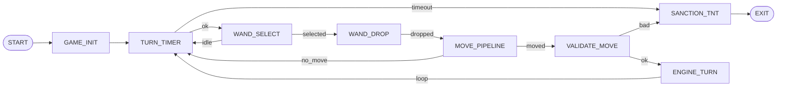
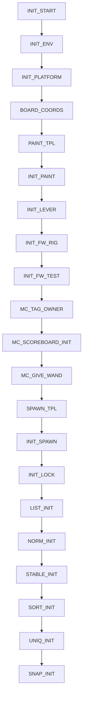
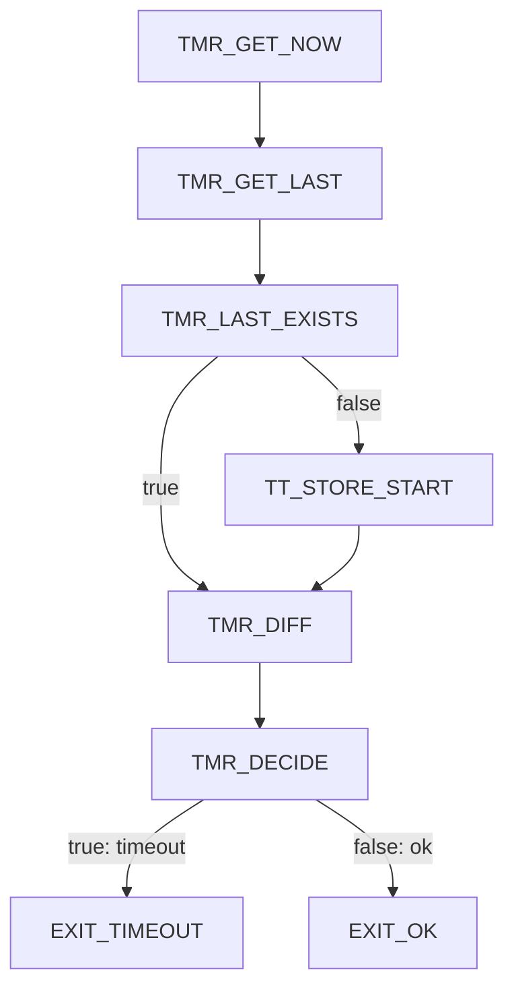
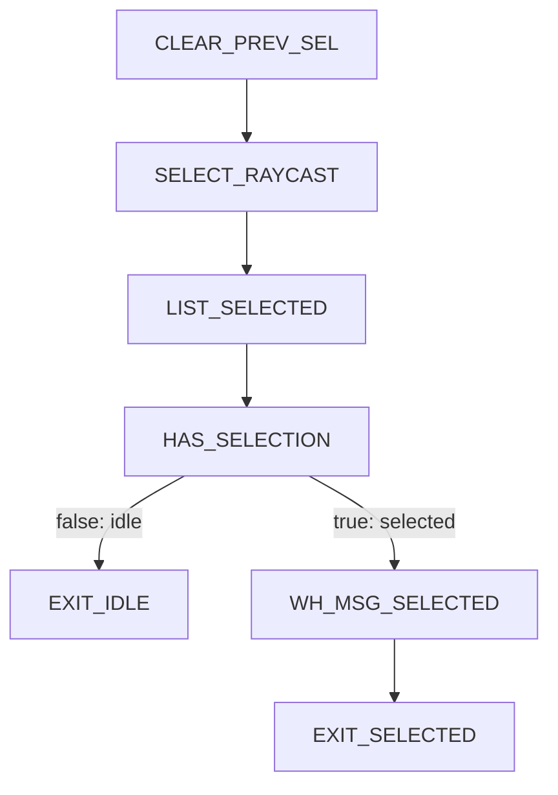
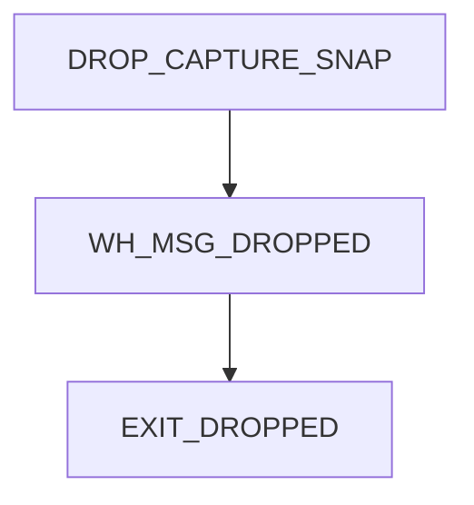
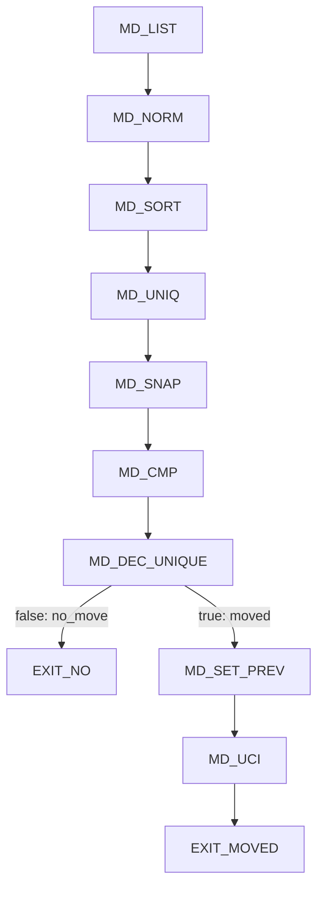
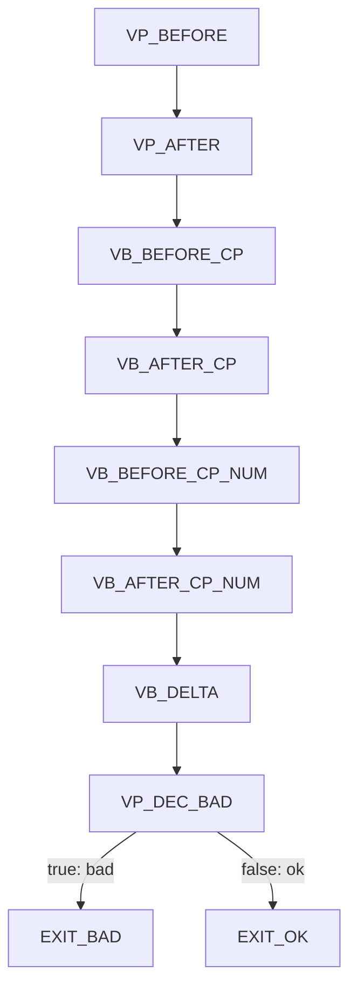
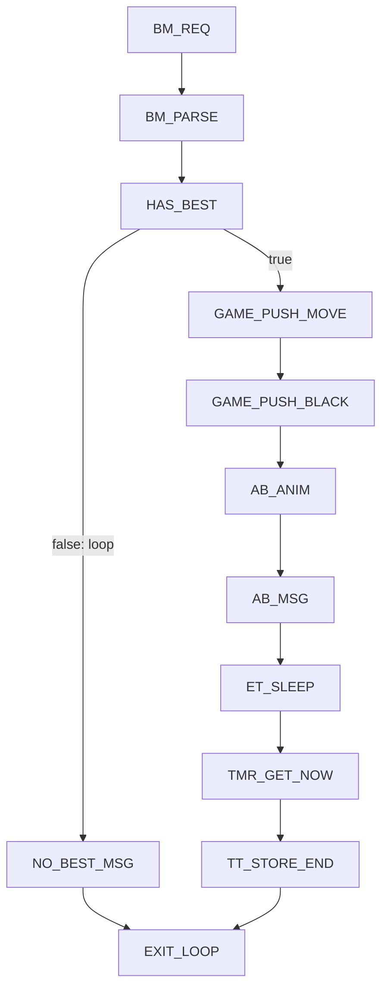
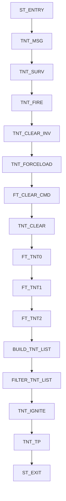

# Minecraft_Stockfish — Visualisation complète (SSOT)

Ce document présente la vue globale et les vues détaillées des sous-graphes du worker Minecraft Stockfish refactoré (Init → TurnTimer → WandSelect → WandDrop → MovePipeline → ValidateMove → EngineTurn, avec SanctionTNT).

---

## Vue globale

---

## Détail: GAME_INIT

- Objet: préparation de l'environnement, damier, levier, rig feux d'artifice, tag propriétaire, scoreboard (ne sert plus au gameplay), baguette, spawn pièces, lock, snapshot initial.

---

## Détail: TURN_TIMER

- Exits: timeout, ok

---

## Détail: WAND_SELECT

- Exits: idle, selected

---

## Détail: WAND_DROP

- Exits: dropped

---

## Détail: MOVE_PIPELINE

- Exits: no_move, moved

---

## Détail: VALIDATE_MOVE

- Exits: bad, ok

---

## Détail: ENGINE_TURN

- Exits: loop

---

## Détail: SANCTION_TNT

- Exit unique: exit
